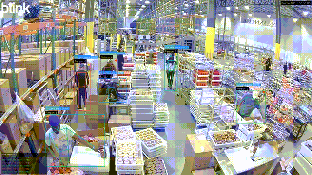
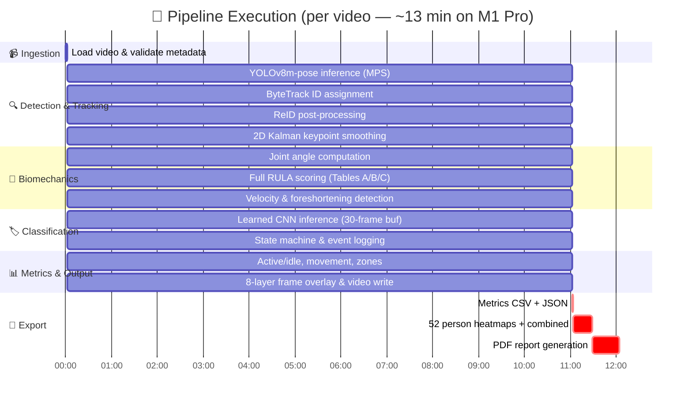
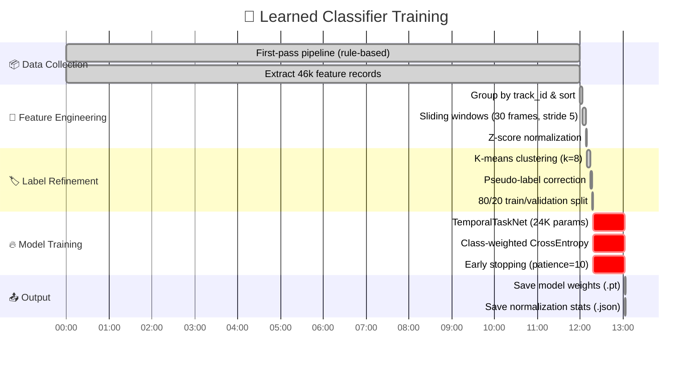

<div align="center">

# Factory Biomechanics Tracker


*Human pose estimation and activity recognition for factory floor analysis. Tracks worker biomechanics, classifies tasks using a learned temporal CNN, and generates productivity metrics from video.*

</div>

---

## Demo

<p align="center">
  
</p>

<p align="center"><em>8-second preview of the annotated output — bounding boxes, skeletons, task labels, RULA badges, zone grid, and live metrics. Full 5-minute video available in <code>output/annotated/</code>.</em></p>

---

## Development Timeline

> **Total development time: 3 hours**

```mermaid
gantt
    title 🏗️ Development Timeline (3 Hours)
    dateFormat HH:mm
    axisFormat %H:%M

    section 🔧 Foundation
    Project scaffolding & config          :done, f1, 00:00, 10m
    requirements.txt & dependencies       :done, f2, after f1, 5m
    Data models (PersonFrame, etc.)       :done, f3, after f2, 10m

    section ⚙️ Core Pipeline
    Video ingestion (VideoReader)         :done, c1, after f3, 10m
    YOLOv8 pose detection                 :done, c2, after c1, 10m
    ByteTrack person tracking             :done, c3, after c2, 15m
    Biomechanics & joint angles           :done, c4, after c3, 15m
    Rule-based task classifier            :done, c5, after c4, 10m
    Metrics engine & zone tracking        :done, c6, after c5, 10m

    section 🎨 Output Generation
    8-layer frame annotator               :done, o1, after c6, 10m
    Heatmap generator                     :done, o2, after o1, 5m
    PDF report (ReportLab)                :done, o3, after o2, 10m
    Pipeline orchestrator & CLI           :done, o4, after o3, 10m

    section 🚀 Upgrades
    Full RULA scoring (Tables A/B/C)      :done, u1, after o4, 10m
    Learned classifier (1D Temporal CNN)  :done, u2, after o4, 15m
    ReID tracking & 2D Kalman filters     :done, u3, after o4, 10m
    Foreshortening & angle smoothing      :done, u4, after u1, 5m

    section ✅ Validation
    Test suite (62 tests)                 :done, t1, after u4, 10m
    First-pass pipeline run (9025 frames) :done, t2, after t1, 12m
    Model training on extracted features  :done, t3, after t2, 2m
    Final pipeline run (learned model)    :done, t4, after t3, 13m
    README & documentation                :done, t5, after t4, 5m
```



## Pipeline Execution Flow



## Training Pipeline



---

## Setup

```bash
pip install -r requirements.txt
```

> Requires **Python 3.10+**. The YOLOv8m-pose model is downloaded automatically on first run.

## Usage

### Full Pipeline (with pre-trained model)

```bash
python pipeline.py --input data/input/video.mp4
```

### Training Workflow (from scratch)

```bash
# Step 1: First pass — extract features with rule-based pseudo-labels
python pipeline.py --input data/input/video.mp4 --extract-features

# Step 2: Train the learned classifier on extracted features
python pipeline.py --train

# Step 3: Run final pipeline with learned classifier (enable in config)
python pipeline.py --input data/input/video.mp4
```

### CLI Options

```bash
python pipeline.py --help
  --config CONFIG     Path to YAML config (default: config/default.yaml)
  --input INPUT       Path to input video (overrides config)
  --extract-features  Save per-frame features for classifier training
  --train             Train learned classifier from extracted features
```

---

## Outputs

All outputs are namespaced by run ID (`YYYYMMDD_HHMMSS`):

| Output | Location | Description |
|---|---|---|
| Annotated Video | `output/annotated/annotated_{run_id}.mp4` | Video with bboxes, skeletons, task labels, RULA badges, zone grid, metric overlays |
| Metrics CSV | `output/metrics/metrics_{run_id}.csv` | One row per tracked person with all metrics |
| Metrics JSON | `output/metrics/metrics_{run_id}.json` | Full nested structure with task event detail |
| Heatmaps | `output/heatmaps/heatmap_person_{id}_{run_id}.png` | Per-person spatial presence heatmaps |
| PDF Report | `output/reports/report_{run_id}.pdf` | Cover, summary table, per-person charts, methodology |

---

## Architecture

```
Video → YOLOv8m-pose → ByteTrack + ReID → Biomechanics (Full RULA)
  → Learned Task Classifier (1D Temporal CNN) → Metrics Engine
  → [Annotated Video, CSV, JSON, Heatmaps, PDF]
```

Each module in `src/` is independently importable. Data flows through `PersonFrame → PersonState → PersonMetrics`.

---

## Key Components

### Task Classification (Learned)

The system uses a **1D Temporal CNN** (TemporalTaskNet) trained on the input video itself:
- Extracts 11 features per frame: 7 joint angles + velocity + centroid xy + RULA score
- Processes 30-frame sliding windows (~1 second at 30fps)
- Architecture: 3 Conv1d layers → BatchNorm → GlobalAvgPool → FC (24K parameters)
- Initial pseudo-labels from rule-based heuristics, refined via K-means clustering
- Falls back to rule-based for the first ~1 second per person (buffer warmup)

**Tasks detected**: `pick_and_place` `lift_and_place` `move_rack` `idle`

### RULA Ergonomic Scoring (Full)

Implements the complete RULA worksheet (McAtamney & Corlett, 1993):
- **Group A**: Upper arm (1-6), lower arm (1-3), wrist (1-4), wrist twist
- **Group B**: Neck (1-6), trunk (1-6), legs (1-2)
- Standard lookup **Tables A, B, C** for final score (1-7)
- Muscle use and force/load adjustments

### Tracking (ByteTrack + ReID)

- **ByteTrack** via ultralytics for primary tracking
- **Post-tracking ReID**: HSV histogram appearance matching + spatial prediction + temporal penalty
- **2D Kalman filters** per keypoint (state: position + velocity) for smoothing
- **90-frame** disappearance tolerance (3 seconds at 30fps)

### 2D Pose Mitigation

- **Foreshortening detection**: Flags unreliable angles when limbs point toward/away from camera
- **Temporal smoothing**: 5-frame weighted moving average on joint angles
- **Body proportion validation**: Detects implausible 2D projection artifacts

---

## Tests

```bash
pytest tests/ -v                           # All tests
pytest tests/ -k "not integration"         # Fast (skip integration)
pytest tests/ --cov=src --cov-report=term  # With coverage
```

> All tests use synthetic data — no real video needed. **62 tests passing.**

---

## Configuration

All settings in `config/default.yaml`:

| Section | Controls |
|---|---|
| `ingestion` | Input path, frame skipping, max frames |
| `tracking` | Detection thresholds, ReID weights, Kalman settings |
| `biomechanics` | Velocity thresholds, full RULA toggle, angle smoothing |
| `classification` | Confidence, duration, cooldown thresholds |
| `learned_classification` | Enable/disable learned model, training hyperparams |
| `zones` | Grid dimensions for dwell tracking |
| `output` | Toggle each output type on/off |

---

## Design Decisions

| Decision | Choice | Why |
|---|---|---|
| Detection model | YOLOv8m-pose | Best accuracy/speed tradeoff with built-in pose on Apple Silicon (MPS) |
| Tracking | ByteTrack + ReID | Handles occlusion; ReID merges fragmented tracks (**190 → 52 persons**) |
| Task classification | Learned 1D CNN | Trained on video itself via pseudo-labels; generalizes better than hard rules |
| Keypoint smoothing | 2D Kalman (pos+vel) | Tracks position and velocity; predicts during brief occlusions |
| Ergonomic scoring | Full RULA (Groups A+B) | Industry-standard with proper lookup tables, not linear approximation |
| PDF generation | ReportLab | Pure Python, no browser dependency, embeds matplotlib charts |

---

## What I Would Do With More Time (6 hours total)

```mermaid
gantt
    title 🔮 Extended Roadmap — What 3 More Hours Would Unlock
    dateFormat HH:mm
    axisFormat %H:%M

    section ✅ Completed (3h)
    Full pipeline with learned classifier      :done, a1, 00:00, 180m

    section 🦴 Hour 4 — 3D Pose & Object Detection
    MotionBERT for 2D→3D pose lifting   :active, h4a, 03:00, 25m
    YOLOv8 object detector (trays/racks) :h4b, after h4a, 20m
    Hand-object proximity confirmation   :h4c, after h4b, 15m

    section 🧠 Hour 5 — Smarter Models
    Label 200 clips for ground truth     :h5a, 04:00, 20m
    Train SlowFast temporal CNN          :h5b, after h5a, 25m
    Fatigue model (RULA trend over shift):h5c, after h5b, 15m

    section 🚀 Hour 6 — Production Readiness
    Real-time RTSP stream processing     :h6a, 05:00, 20m
    FastAPI web dashboard + live metrics :h6b, after h6a, 20m
    Multi-camera view fusion             :h6c, after h6b, 15m
    Docker containerization + CI/CD      :h6d, after h6c, 5m
```



### Hour 4 — 3D Pose & Object Detection
- **3D pose lifting** with MotionBERT to convert 2D keypoints to 3D joint positions — eliminates foreshortening issues entirely and gives accurate joint angles regardless of camera angle
- **Object detection** for trays, racks, and tools using a fine-tuned YOLOv8 — confirms task interactions by checking hand-object proximity rather than relying on pose alone

### Hour 5 — Smarter Models
- **Hand-labeled training data** — annotate 200 short clips with ground-truth task boundaries, replacing pseudo-labels with verified ones
- **SlowFast temporal CNN** — a heavier temporal model that processes both slow (posture) and fast (motion) pathways for more precise task segmentation
- **Fatigue modeling** — track each worker's RULA score trend across the full shift to flag cumulative ergonomic risk before injury occurs

### Hour 6 — Production Readiness
- **Real-time mode** — refactor the pipeline to process live RTSP camera streams with sub-second latency using batch GPU inference
- **Web dashboard** — FastAPI backend serving live metrics, annotated video clips, and heatmaps to a browser-based ops dashboard
- **Multi-camera fusion** — combine views from 2-4 cameras to resolve occlusions and improve zone accuracy through triangulation
- **Docker + CI/CD** — containerized deployment with GitHub Actions running the test suite on every push
